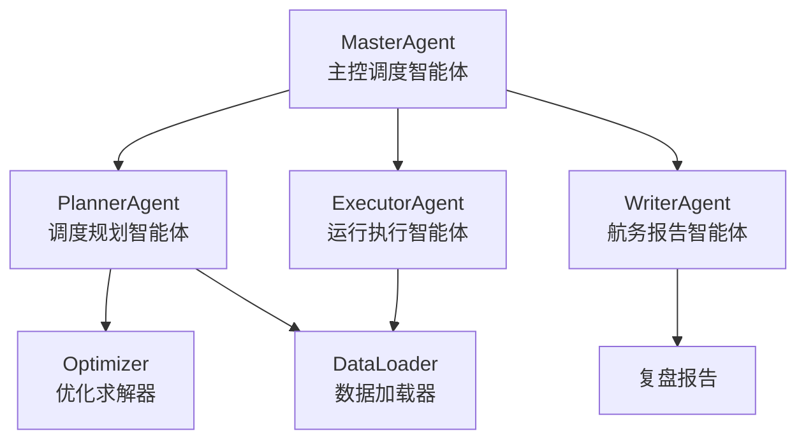
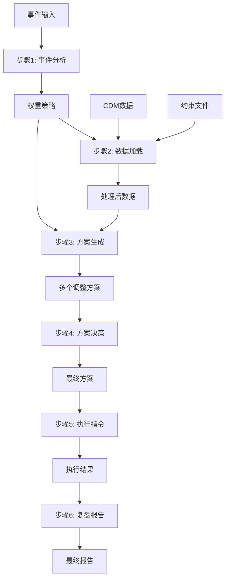

# 航班调整系统 (Flight Adjustment System)

一个基于AI智能体和运筹优化的航班调整系统，能够智能分析航空运营事件并生成最优的航班调整方案。

## 🚀 快速开始

### 一键启动（推荐）
```bash
# 同时启动前后端服务
make dev
```

访问地址：
- **前端界面**: http://localhost:3000 - 简洁优雅的用户界面
- **后端API**: http://localhost:8000 - RESTful API服务  
- **API文档**: http://localhost:8000/docs - 自动生成的接口文档

### 其他常用命令
```bash
make help      # 查看所有可用命令
make install   # 安装项目依赖
make status    # 检查服务状态
make stop      # 停止所有服务
make clean     # 清理临时文件
make restart   # 重启所有服务
```

### 手动启动（高级用户）
如果需要单独启动服务：
```bash
# 启动前端
make frontend

# 启动后端
make backend
```

## 🎯 系统概述

当航空运营中出现流量控制、恶劣天气、设备故障等突发事件时，本系统能够：
- 智能分析事件类型和严重程度
- 自动加载和处理CDM数据及约束条件
- 生成包含6种调整动作的优化方案
- 智能决策最佳执行方案
- 自动下发执行指令
- 生成详细的复盘报告

## 🎯 支持的航班调整动作

系统支持航空运营中的6种标准调整动作：

| 动作代码 | 动作名称 | 生成条件 | 主要输出内容 | 适用场景说明 |
|---------|---------|----------|-------------|-------------|
| **CHANGE_TIME** | 变更时刻 | 延误原因触发时自动生成 | 新旧时刻对比、延误时长、审批需求等时间调整相关信息 | 天气、空管、设备故障等导致的临时延误，是最常用的调整策略，占所有调整的60-70% |
| **CHANGE_AIRCRAFT** | 更换飞机 | 有可用替代飞机时生成 | 新旧飞机对比、座位变化、调机需求等飞机资源调配信息 | 原飞机故障、维修冲突、机型不适用等情况，需要充足的飞机资源池支撑 |
| **CANCEL_FLIGHT** | 取消航班 | 无其他可行方案时生成 | 旅客数量、赔偿估算、衔接影响等取消后果评估信息 | 严重天气、长时间设备故障、安全原因等极端情况的最后选择 |
| **CHANGE_AIRPORT** | 变更机场 | 有同城备选机场时生成 | 航线变更、距离差异、地面交通等机场替换相关信息 | 机场关闭、跑道不可用、容量饱和等机场运营问题的替代方案 |
| **CHANGE_NATURE** | 变更性质(少见) | 特定条件满足时生成 | 性质变更前后对比、影响评估等航班属性调整信息 | 无旅客的货运、运力调配需要等特殊运营调整 |
| **ADD_FLIGHT** | 新增航班 | 补偿或增运力需求时生成 | 新航班信息、补位目的、资源需求等新增航班配置信息 | 取消航班的补偿、运力不足的加班、特殊任务的专机等 |

## 🏗️ 系统架构

### 核心组件

```
flight-adjustment-system/
├── src/backend/
│   ├── agents/          # 智能体模块
│   │   ├── MasterAgent.py      # 主控调度智能体
│   │   ├── PlannerAgent.py     # 调度规划智能体
│   │   ├── ExecutorAgent.py    # 运行执行智能体
│   │   └── WriterAgent.py      # 航务报告智能体
│   ├── tools/           # 工具模块
│   │   ├── DataLoader.py       # 数据加载器
│   │   └── Optimizer.py        # 优化求解器
│   └── main.py          # 系统主入口
├── assets/              # 数据资源
│   ├── cdm/            # CDM数据文件
│   └── restriction/    # 约束条件文件
├── requirements.txt     # 依赖包列表
└── README.md           # 说明文档
```

### 智能体架构



## 🔧 安装和配置

### 环境要求

- Python 3.11+
- GLPK求解器
- 必要的Python依赖包

### 安装步骤

1. **克隆项目**
```bash
git clone <repository-url>
cd flight-adjustment-system
```

2. **安装Python依赖**
```bash
pip install -r requirements.txt
```

3. **安装GLPK求解器**

macOS:
```bash
brew install glpk
```

Ubuntu/Debian:
```bash
sudo apt-get install glpk-utils
```

Windows:
请从 [GLPK官网](http://www.gnu.org/software/glpk/) 下载并安装

### 配置说明

在使用前，请确保：
- 在 `assets/cdm/` 目录下放置CDM数据文件（Excel格式）
- 在 `assets/restriction/` 目录下放置约束条件文件（CSV格式）
- 在各智能体中配置正确的API密钥（如需要）

## 🚀 使用方法

### 基本运行

```bash
python src/backend/main.py
```

### 自定义运行

修改 `main.py` 中的参数：

```python
# 定义本次需要处理的数据文件
cdm_data_file_path = 'assets/cdm/your_cdm_data.xlsx'
constraint_dir_path = 'assets/restriction'

# 模拟一个外部事件触发系统
event_description = "你的事件描述"

# 运行完整的场景处理流程
result = flight_adjustment_system.run(event_description, cdm_data_file_path, constraint_dir_path)
```

## 📊 系统运行流程详解

系统采用6步骤智能处理流程，每个步骤都有明确的输入、处理逻辑和输出产物：

### 步骤1：事件分析和策略生成

**📥 输入**
```
event_description: "上海区域流量控制，多个航班收到CTOT指令"
```

**🔄 处理过程**
- **MasterAgent.get_weights()** 调用LLM分析事件
- 识别事件类型：流量控制、天气、设备故障、安全事件等
- 评估严重程度：轻度、中度、重度
- 基于事件特征生成差异化权重策略

**📤 输出产物**
```python
weights = {
    "方案A (成本优先)": {
        "cancel": 1.0,           # 基础取消成本权重
        "delay": 0.1,            # 基础延误成本权重
        "late_pax": 0.5,         # 晚点旅客影响权重
        "revenue": 1.0,          # 收入损失权重
        "change_time": 0.2,      # 变更时刻成本权重
        "change_aircraft": 0.8,  # 更换飞机成本权重
        "cancel_flight": 1.0,    # 取消航班成本权重
        "change_airport": 0.6,   # 变更机场成本权重
        "change_nature": 0.3,    # 变更性质成本权重
        "add_flight": 0.9        # 新增航班成本权重
    },
    "方案B (运营优先)": {
        "cancel": 0.5,           # 基础取消成本权重
        "delay": 1.0,            # 基础延误成本权重
        "late_pax": 1.0,         # 晚点旅客影响权重
        "revenue": 0.2,          # 收入损失权重
        "change_time": 0.1,      # 变更时刻成本权重（优先选择）
        "change_aircraft": 0.4,  # 更换飞机成本权重
        "cancel_flight": 0.8,    # 取消航班成本权重
        "change_airport": 0.3,   # 变更机场成本权重
        "change_nature": 0.2,    # 变更性质成本权重
        "add_flight": 0.5        # 新增航班成本权重
    }
}
```

---

### 步骤2：数据加载和预处理

**📥 输入**
```
cdm_data_file_path: "assets/cdm/cdm_cleaned.xlsx"
constraint_dir_path: "assets/restriction"
```

**🔄 处理过程**
- **DataLoader.load_cdm_data()** 加载航班数据
  - 时间格式标准化
  - 提取航空公司代码
  - 计算飞行时长和收入
  - 确定目标起飞/到达时间
- **DataLoader.load_constraint_data()** 加载约束条件
  - 过滤当前有效的约束
  - 按约束类型分类存储

**📤 输出产物**
```python
# CDM数据 (DataFrame)
cdm_data = pd.DataFrame({
    '航班号': ['CA3136', 'CA824', ...],
    '计划起飞时间': [datetime, datetime, ...],
    'target_departure_time': [datetime, datetime, ...],
    'revenue': [75000, 48500, ...],
    'carrier_code': ['CA', 'CA', ...],
    ...
})

# 约束数据 (字典)
constraint_data = {
    'airport_restriction': DataFrame(147条记录),
    'airport_special_requirement': DataFrame(48条记录),
    'flight_restriction': DataFrame(4条记录),
    'flight_special_requirement': DataFrame(0条记录),
    'sector_special_requirement': DataFrame(979条记录)
}
```

---

### 步骤3：生成调整方案

**📥 输入**
```
cdm_data: 处理后的航班数据
constraint_data: 约束条件数据
weights: 各策略权重
```

**🔄 处理过程**
- **PlannerAgent.create_adjustment_plan()** 为每种策略生成方案
- **Optimizer.build_model()** 构建Pyomo优化模型
  - 决策变量：x(执行/取消), d(延误时间), l(严重晚点)
  - 目标函数：多目标加权优化
  - 约束条件：机场宵禁、机组时间、特殊要求等
- **Optimizer.solve_model()** 使用GLPK求解器求解
- **PlannerAgent.validate_plan()** 验证方案合理性

**📤 输出产物**
```python
solutions = {
    "方案A (成本优先)": pd.DataFrame({
        '航班号': ['CA3136', 'CA824', 'CA702', ...],
        'adjustment_action': ['取消航班', '变更时刻', '更换飞机', ...],
        'status': ['取消', '执行', '执行', ...],
        'additional_delay_minutes': [0.0, 30.0, 0.0, ...],
        'adjusted_departure_time': [NaT, datetime, datetime, ...],
        'change_time': [False, True, False, ...],
        'change_aircraft': [False, False, True, ...],
        'cancel_flight': [True, False, False, ...],
        'change_airport': [False, False, False, ...],
        'change_nature': [False, False, False, ...],
        'add_flight': [False, False, False, ...]
    }),
    "方案B (运营优先)": pd.DataFrame({...})
}

# 调整动作统计
action_stats = {
    '变更时刻': 45,
    '更换飞机': 8,
    '取消航班': 25,
    '变更机场': 3,
    '变更性质': 1,
    '新增航班': 2,
    '正常执行': 16
}

# 约束应用统计
constraint_stats = {
    'airport_curfew': 2,
    'sector_requirements': 96
}
```

---

### 步骤4：方案分析和决策

**📥 输入**
```
solutions: 各策略生成的调整方案
```

**🔄 处理过程**
- **MasterAgent.interpret_and_present_solutions()** 智能分析对比
- 解读每个方案的特点：
  - 取消航班数量和比例
  - 总延误时间
  - 旅客影响程度
- LLM辅助决策，选择最优方案
- 生成方案对比报告

**📤 输出产物**
```python
chosen_plan_name = "方案A (成本优先)"

final_plan = pd.DataFrame({
    '航班号': ['CA3136', 'CA824', 'CA702', ...],
    'status': ['取消', '执行', '取消', ...],
    'additional_delay_minutes': [0.0, 0.0, 0.0, ...],
    'adjusted_departure_time': [NaT, '2025-06-01 00:05:00', NaT, ...]
})

# 方案解读文本
plan_analysis = """
--- 方案A (成本优先) ---
解读: 此方案建议取消 25 个航班，保留 75 个航班
     总附加延误为 0 分钟
[详细数据表格]
"""
```

---

### 步骤5：执行调整指令

**📥 输入**
```
final_plan: 最终选定的调整方案
```

**🔄 处理过程**
- **ExecutorAgent.validate_execution_feasibility()** 可行性验证
- **ExecutorAgent.execute_plan()** 模拟执行
  - 生成具体指令（取消/延误/正常）
  - 记录执行过程和结果
  - 统计执行情况
- **ExecutorAgent.get_execution_status()** 获取执行状态

**📤 输出产物**
```python
# 执行指令列表（6种调整动作）
execution_instructions = [
    {
        'type': 'CANCEL_FLIGHT',
        'flight_number': 'CA3136',
        'reason': '根据运行优化决策',
        'message': '取消航班 CA3136',
        'compensation_needed': True,
        'passenger_count': 168
    },
    {
        'type': 'CHANGE_TIME',
        'flight_number': 'CA824',
        'delay_minutes': 30,
        'old_departure_time': '2025-06-01 00:05:00',
        'new_departure_time': '2025-06-01 00:35:00',
        'message': '航班 CA824 变更起飞时间，延误 30 分钟'
    },
    {
        'type': 'CHANGE_AIRCRAFT',
        'flight_number': 'CA702',
        'reason': '飞机资源调配',
        'message': '航班 CA702 更换执行飞机',
        'requires_crew_check': True,
        'requires_maintenance_sign': True
    },
    {
        'type': 'CHANGE_AIRPORT',
        'flight_number': 'CA872',
        'reason': '机场运营调整',
        'message': '航班 CA872 变更起降机场',
        'requires_atc_approval': True,
        'requires_passenger_notice': True
    },
    {
        'type': 'ADD_FLIGHT',
        'flight_number': 'CA9001',
        'reason': '运力补充',
        'message': '新增航班 CA9001',
        'requires_slot_allocation': True,
        'requires_crew_assignment': True
    },
    ...
]

# 执行状态统计（包含6种调整动作）
execution_status = {
    'latest_summary': {
        '总航班数': 100,
        '变更时刻': 45,
        '更换飞机': 8,
        '取消航班': 25,
        '变更机场': 3,
        '变更性质': 1,
        '新增航班': 2,
        '正常执行': 16,
        '总延误时间': 1350,  # 分钟
        '平均延误': 30,      # 分钟
        '执行时间': '2025-08-14 22:28:02'
    }
}
```

---

### 步骤6：生成复盘报告

**📥 输入**
```
event_description: 原始事件描述
chosen_plan_name: 选定方案名称
final_plan: 最终执行方案
execution_summary: 执行结果统计
```

**🔄 处理过程**
- **WriterAgent.generate_report()** 智能生成报告
- 分析处理效果和关键指标
- 总结经验教训
- 提出改进建议
- 格式化输出专业报告

**📤 输出产物**
```markdown
============================================================
### 航班调整事件复盘报告  
**事件时间：2025-08-14 22:28:02**

#### 1. 事件概述与处理策略  
**事件描述：** 上海区域因流量控制发布CTOT指令...
**处理策略：** 采用成本优先策略（方案A）...

#### 2. 关键指标分析与评估  
| 指标 | 数值 | 评估 |
|------|------|------|
| 总航班数 | 100架次 | 全部纳入调整范围 |
| 取消航班数 | 25架次（25%） | 显著降低运行压力 |
| 正常执行航班数 | 75架次（75%） | 无延误，效率达标 |

#### 3. 处理效果总结  
- **优势：** 效率优先，成本可控，零延误结果...
- **不足：** 取消航班比例较高...

#### 4. 经验教训与改进建议  
1. **动态优先级调整**：引入航班价值评估模型...
2. **旅客补偿预案**：对取消航班提前制定改签方案...
============================================================
```

## 🔄 完整数据流转图



## 📋 中间产物存储

系统运行过程中的关键中间产物：

- **权重策略**: 存储在内存中的字典对象
- **处理后数据**: Pandas DataFrame格式，包含清洗后的航班和约束数据
- **优化方案**: 每个策略对应一个DataFrame，包含调整决策
- **执行指令**: 结构化的指令列表，包含具体操作和参数
- **执行状态**: 统计信息字典，记录执行结果
- **复盘报告**: Markdown格式的结构化文本报告

所有中间产物都经过验证和格式化，确保数据质量和系统可靠性。

## 📈 功能特性

### 🧠 智能分析
- 基于大语言模型的事件理解和分析
- 智能策略生成和方案对比
- 自然语言处理和报告生成

### 🔧 优化求解
- 基于Pyomo的数学建模
- 支持多目标优化：
  - 最小化取消航班收入损失
  - 最小化总延误时间
  - 最小化严重晚点旅客影响
  - 最小化晚点收入损失
- 处理复杂约束条件

### 📊 数据处理
- 支持Excel和CSV格式
- 自动数据清洗和预处理
- 时间格式标准化
- 缺失值智能填充

### 🎯 决策支持
- 多方案生成和对比
- 风险评估和可行性分析
- 智能推荐最优方案

## 📋 数据格式要求

### CDM数据文件 (Excel格式)
必须包含以下列：
- `航班号`: 航班编号
- `计划起飞时间`: 原计划起飞时间
- `预计起飞时间`: 预计起飞时间
- `CTOT`: 流量控制起飞时间（如有）
- `预计落地时间`: 预计落地时间
- `计划起飞机场`: 起飞机场代码
- `计划落地机场`: 到达机场代码
- `旅客人数(订座)`: 订座旅客数量

### 约束条件文件 (CSV格式)
各约束文件的格式请参考 `assets/restriction/` 目录下的示例文件。

## 🔧 自定义和扩展

### 添加新的约束类型
1. 在 `DataLoader.py` 中添加新的约束文件加载逻辑
2. 在 `Optimizer.py` 中实现对应的约束处理方法
3. 更新约束统计和验证逻辑

### 修改优化目标
在 `Optimizer.py` 的 `build_model` 方法中修改目标函数：
```python
model.objective = pyo.Objective(
    expr = weights['cancel'] * revenue_loss + \
           weights['delay'] * total_delay + \
           weights['late_pax'] * late_pax_impact + \
           weights['revenue'] * late_revenue_loss + \
           # 添加新的目标项
           weights['new_objective'] * new_cost,
    sense=pyo.minimize
)
```

### 集成新的求解器
支持的求解器包括：
- GLPK (默认)
- CBC
- Gurobi (需要许可证)
- CPLEX (需要许可证)

## 🐛 故障排除

### 常见问题

**1. 求解器找不到**
```
Error: No executable found for solver 'glpk'
```
解决方案：确保已正确安装GLPK求解器

**2. 数据格式错误**
```
Error: KeyError: '航班号'
```
解决方案：检查CDM数据文件是否包含必要的列

**3. 约束文件缺失**
```
Warning: 约束文件未找到
```
解决方案：确保约束文件存在于指定目录

**4. 内存不足**
对于大规模数据集，可能需要：
- 增加系统内存
- 分批处理数据
- 优化模型规模

## 📝 更新日志

### v1.0.0 (当前版本)
- ✅ 完整的6步骤智能处理流程
- ✅ 多智能体协作架构
- ✅ 数学优化求解引擎
- ✅ 5种约束条件支持
- ✅ 智能报告生成
- ✅ 错误处理和异常恢复

## 🤝 贡献指南

欢迎提交Issue和Pull Request来改进系统！

## 📄 许可证

[在此添加许可证信息]

## 📞 联系方式

如有问题或建议，请联系：
- Email: [在此添加邮箱]
- GitHub Issues: [在此添加链接]

---

**注意**: 本系统为航空运营决策支持工具，实际使用时请结合专业运行人员的判断。
